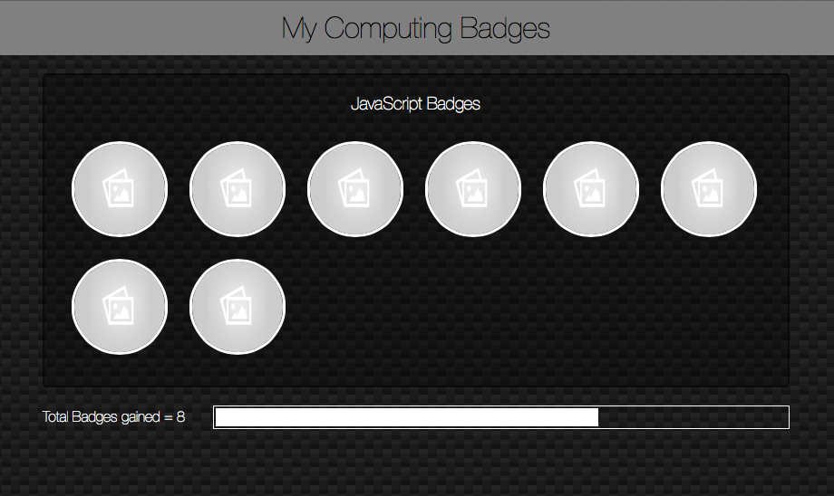

## Year 7 - Web Development - An Introduction to JavaScript

### Target year group or age

Key Stage 3 - Year 7

### Purpose of Module

The purpose of this module is to introduce students to their first text-based programming language, and a few key concepts in Computer Science
The module builds upon the student's experience writing HTML and CSS, by using JavaScipt in a familair environment.

### Knowledge and Skills

* I/O with JavaScript
* Variable decleration, assignment and reassignment
* Conditional statements
* Iteration
* Functions

### Cross-Curricula / Literacy / Numeracy
* There are numerous opportunities for developing numeracy  within the unit 
  - Lesson 1 asks the students to create an equation for calcualting the year an individual will reach 100
  - Lesson 2 requires students to use conditional statements to find correct answers to mathematical questions and present a score as a percentage
  - Lesson 3 looks at a mathematical solution for swapping variables
  - Lesson 6 looks at percentages with regard to counting the badges earned by a student.
* There are numerous opportunites for developing literacy within the unit
  - JavaScript requires syntactic precision which helps improve the students literacy skills
  - Within the quiz that students create, there are opportunites to develop literacy, with a focus on spelling, puntuation and grammar.
  
### Progression from this module

Web Development - Building games with JavaScript

### Example work

The conlcusion of the project, is to produce a Web Page for displaying digital badges that have been earned by the student.

### Glossary

|          |        |         |           |
|----------|--------|---------|-----------|
|Script tag|Variable|Declare  |Assign     |
|Strings   |Boolean |Console  |Conditional|
|Operator  |Loop    |For      |Iteration  |
|Function  |DOM     |         |           |

### Self-assessment questions

1. _How many badges did I obtain?_
2. _What was the easiest thing to do in JavaScript?_
3. _What was the hardest thing to do in JavaScript?_
4. _What was the thing I enjoyed the most about this topic?_
5. _If I had to do this topic again, what would I do differently?_

### Work-criteria check-list

|Lesson 1|Lesson 2|Lesson 3|Lesson 4|Lesson 5|Lesson 6|
|:---:|:---:|:---:|:---:|:---:|:---:|
|Create Greeter.html|Maths Question|Code swaps variable values|
|Add Boilerplate|Question with 3 answers|   |
|window.alert('Welcome')|4 Questions of choice|   |
|Ask and store name|Give Score|   |
|Output using variable|Use Score for message|   |
|Ask age|   |   |
|Calc and Output|   |   |

### Homework

This module is self-paced. Students should continue to work on the problems both inside and outside of lessons.
Depending on lesson length, student ability and time spent outside of lessons, I have found that each activity takes the students between 1 and 2 hours to complete.

### [DfE Computing Curriculum mapping](https://www.gov.uk/government/publications/national-curriculum-in-england-computing-programmes-of-study)
* design, use and evaluate computational abstractions that model the state and behaviour of real-world problems and physical systems
* use two or more programming languages, at least one of which is textual, to solve a variety of computational problems; make appropriate use of data structures [for example, lists, tables or arrays]; design and develop modular programs that use procedures or functions

### [CaS Progression Pathways mapping](http://community.computingatschool.org.uk/resources/1692)
* Understands the difference between, and appropriately uses if and if, then and else statements. Uses a variable and relational operators within a loop to govern termination. Designs, writes and debugs modular programs using procedures. Knows that a procedure can be used to hide the detail with sub-solution (procedural abstraction).

### Lessons - Student resources

* [Lesson 1 - An Introduction to Javascript](http://marcscott.github.io/7-WD-JS/pages/1_Lesson.html)
* [Lesson 2 - Conditionals and the Console](http://marcscott.github.io/7-WD-JS/pages/2_Lesson.html)
* [Lesson 3 - The Value of Variables](http://marcscott.github.io/7-WD-JS/pages/3_Lesson.html)
* [Lesson 4 - Dominating the DOM](http://marcscott.github.io/7-WD-JS/pages/4_Lesson.html)
* [Lesson 5 - Loopy JavaScript](http://marcscott.github.io/7-WD-JS/pages/5_Lesson.html)
* [Lesson 6 - A Functional Project](http://marcscott.github.io/7-WD-JS/pages/6_Lesson.html)

### Lessons - Teacher resources

* [Lesson 1 - An Introduction to Javascript]()
* [Lesson 2 - Conditionals and the Console]()
* [Lesson 3 - The Value of Variables]()
* [Lesson 4 - Dominating the DOM]()
* [Lesson 5 - Loopy JavaScript]()
* [Lesson 6 - A Functional Project]()

### Resources

Computers with a web-browser and a text-editor installed are all that are needed.

Recommended web-browsers are as follows:

:poop:    [I.E.](http://www.mozilla.org/en-GB/firefox/new/)  
:snail:    [Safari](http://www.mozilla.org/en-GB/firefox/new/)  
:see_no_evil:    [Chrome](http://www.mozilla.org/en-GB/firefox/new/)  
:smiling_imp:    [FireFox](http://www.mozilla.org/en-GB/firefox/new/)  

Recommended text-editors are as follows:

:bowtie:    [Sublime Text](http://www.sublimetext.com)  
:sunglasses:    [Atom](https://atom.io)  
:neckbeard:    [Emacs](http://www.gnu.org/software/emacs/)  

